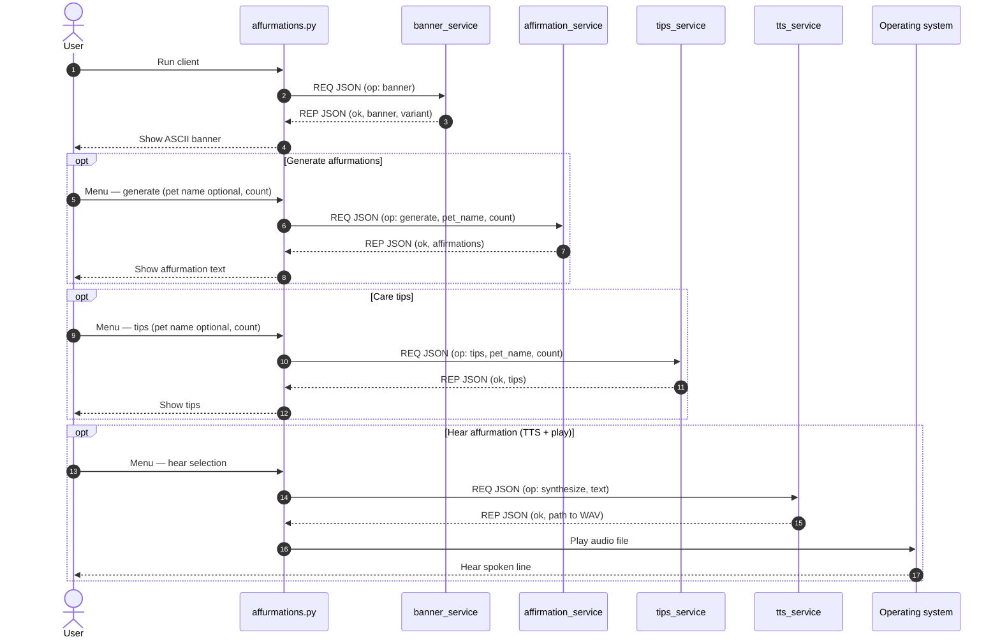

# Affurmations

Text-based client that talks to small **ZeroMQ** microservices: it generates comforting “affurmations” for people caring for a sick pet, shows random ASCII banners, offers gentle care tips, and can turn lines into speech (via your OS voice).

## Requirements

- **Python 3.10+** (3.11+ recommended)
- **pip**
- On Windows, if `python` is not on your PATH, use the **py** launcher (`py -3`) instead of `python` in the commands below.

## Install

From the project root:

```bash
pip install -r requirements.txt
```

Dependencies: **pyzmq**, **pyttsx3** (uses the system TTS engine; on Windows that is typically SAPI5).

## How to run

### Easiest: launcher (starts all services + client)

From the project root:

```bash
python run_affurmations.py
```

This starts four background processes (banner, affirmation, tips, TTS), waits a second, then runs `affurmations.py`. When you quit the client, the launcher stops the services.

### Manual: five terminals (or background jobs)

1. Start each service from the project root (order does not matter):

   ```bash
   python services/banner_service.py
   python services/affirmation_service.py
   python services/tips_service.py
   python services/tts_service.py
   ```

2. In another session, run the client:

   ```bash
   python affurmations.py
   ```

If a service is missing, the client still runs but the matching features time out or show a short fallback (for example the banner).

### ZeroMQ endpoints (localhost)

| Service        | Script                    | Bind address              |
|----------------|---------------------------|---------------------------|
| Affirmations   | `affirmation_service.py`  | `tcp://127.0.0.1:5555`    |
| Text-to-speech | `tts_service.py`          | `tcp://127.0.0.1:5556`    |
| Banner art     | `banner_service.py`       | `tcp://127.0.0.1:5557`    |
| Care tips      | `tips_service.py`         | `tcp://127.0.0.1:5558`    |

Messages are **JSON** over **ZeroMQ REQ/REP**: the client sends a request, one service replies.

### Audio output

Spoken lines are written under `output/` (ignored by git). Playback uses **winsound** on Windows, **afplay** on macOS, and **aplay** / **paplay** on Linux when available.

## Project layout

```
Affurmations/
  affurmations.py          # CLI client (REQ sockets)
  run_affurmations.py      # Spawns services, then client
  requirements.txt
  shared/                  # Shared config + JSON helpers
  services/                # REP microservices (one process each)
```

## How the software works (UML sequence diagram)

The figure below is a **UML sequence diagram** expressed in [Mermaid](https://mermaid.js.org/) (`sequenceDiagram`). It shows how the text client talks to each microservice over **ZeroMQ REQ/REP** with **JSON** bodies. Optional menu paths use UML-style **opt** (optional) combined fragments. Rendered output appears on GitHub and in Mermaid-capable editors.



---

**Note:** This is not medical or veterinary advice; tips and affirmations are for emotional and practical support only.
